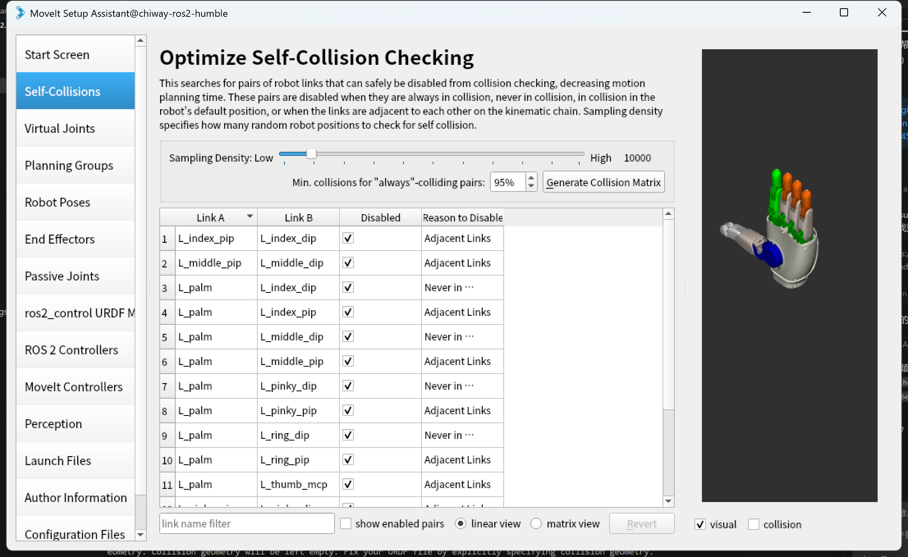
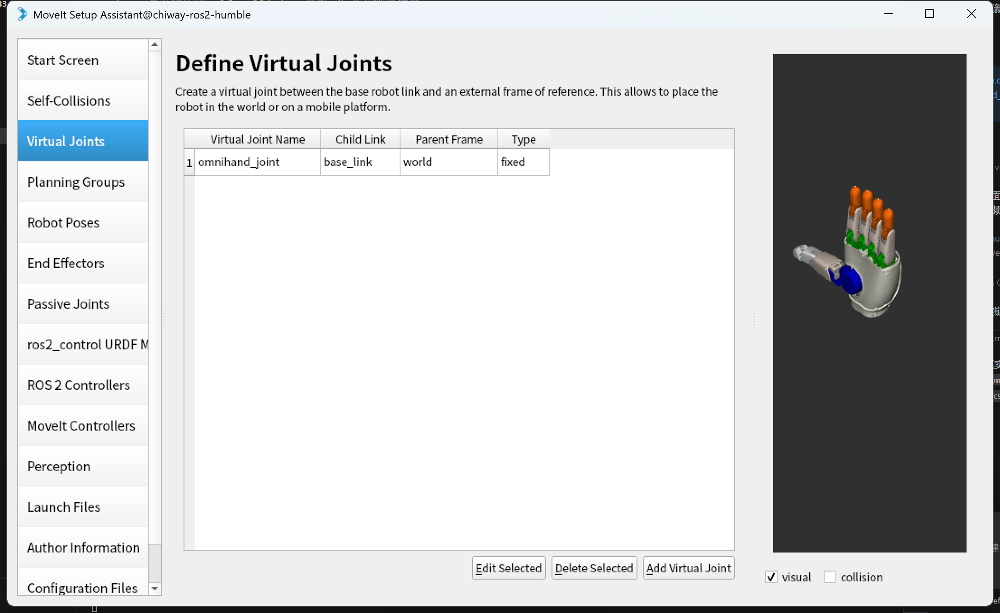
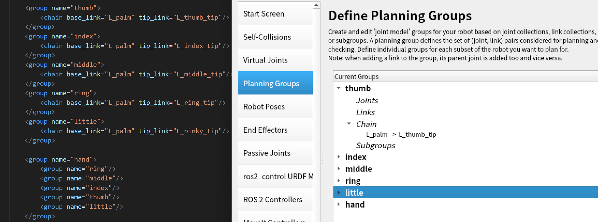
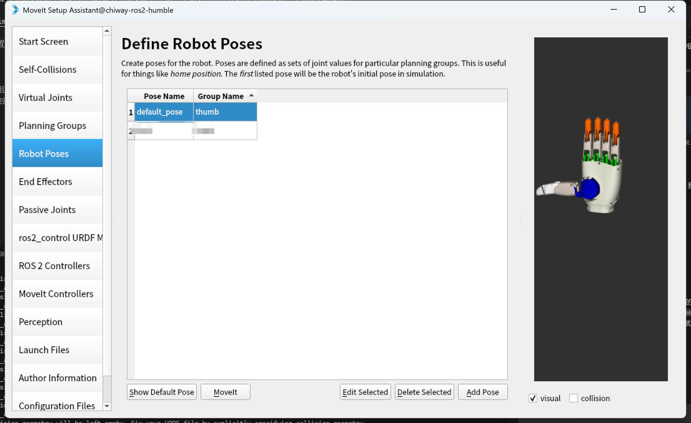
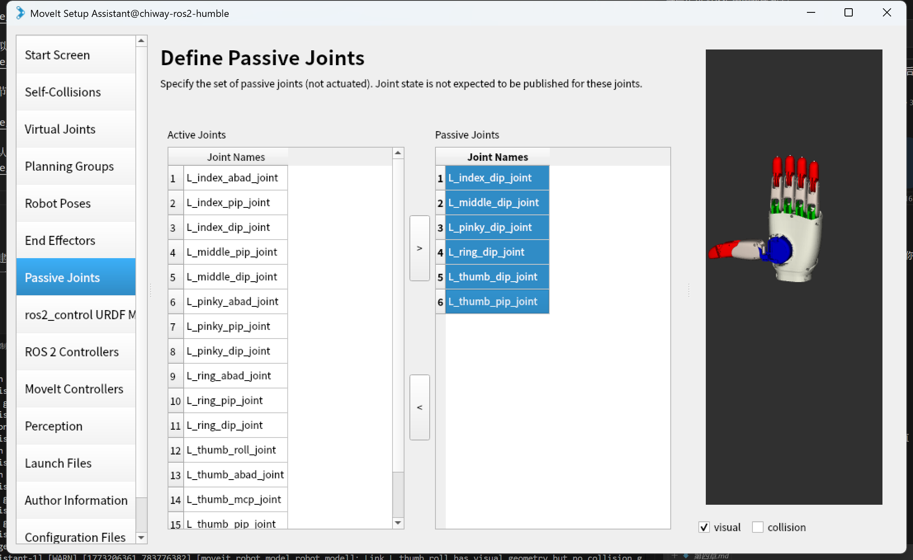
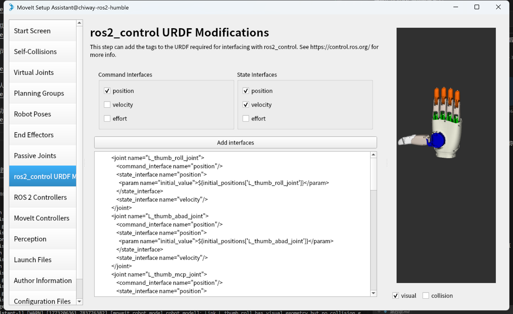
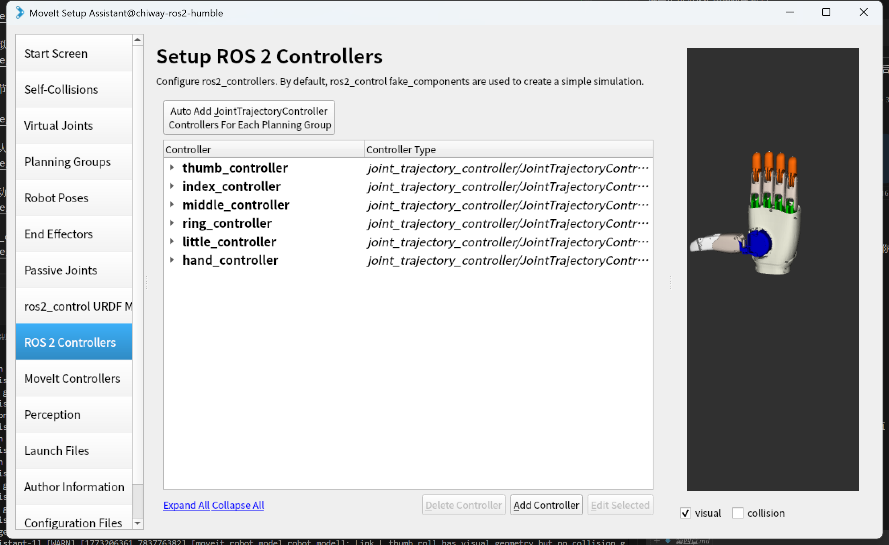

# 第三章 灵巧手moveit包构建
[moveit包官方构建流程](https://moveit.picknik.ai/main/doc/examples/setup_assistant/setup_assistant_tutorial.html)

## 配置依赖
- 安装moveit
```bash
sudo apt install ros-<ros-distro>-moveit
```

## 创建description功能包

- 开始构建之前,需要将sdk中的urdf文件夹复制到任意一个功能包中,并修改其中的urdf文件,将其中的mesh文件路径改为当前功能包的路径
......
- 详细过程不再赘述,可以直接使用我配置好的description包

- 因为moveit要用到碰撞模型,官方提供的urdf文件中的碰撞模型为简单几何体,极其容易发生碰撞,我已经将urdf中的碰撞模型改为与视觉模型相同的mesh文件

## 配置moveit配置包
> 如果大家不愿意手动配置moveit配置包,也可以直接使用我已经配置好的moveit配置包

- 启动moveit配置助手
```bash
ros2 launch moveit_setup_assistant setup_assistant.launch.py
```
- 在配置助手中选择创建新的moveit配置包
- 选择灵巧手的urdf文件
- 点击加载
- 点击侧边的self-collisions选项,生成自碰撞信息

> 只勾选相同手指之间的碰撞信息,不勾选不同手指之间的碰撞信息,以免使手指之间本来存在的机械关系被误判为碰撞关系,导致moveit无法规划出合理的路径



- 配置虚拟关节,将base_link和world连接起来,并设置为固定关节



- 配置关节组,根据手指的结构配置关节组,每个手指一个组,再将所有的关节组放到一个总的hand组中



- 配置默认手势



- 定义被动关节



- 为ros2_control配置控制器接口,点击添加接口即可



- 设置ros2_control控制器,点击自动添加即可



- moveit控制器同样设置为自动添加

- 最后点击最下方的生成按钮,生成moveit配置包


## 启动示例程序查看构建效果
> ros2 launch hand_moveit demo.launch.py

