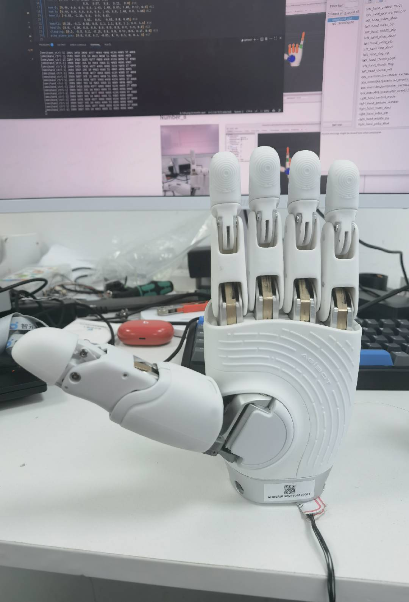
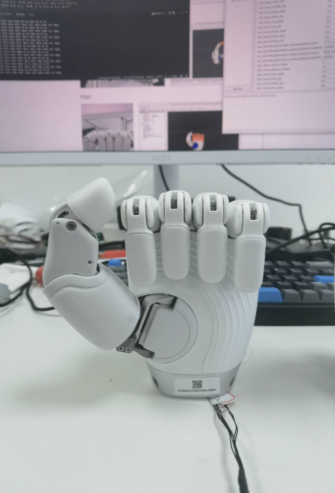
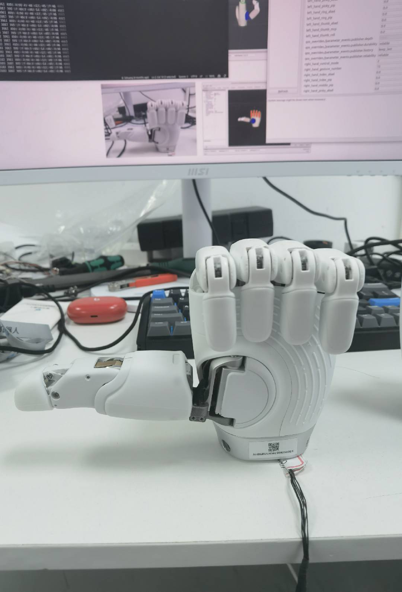
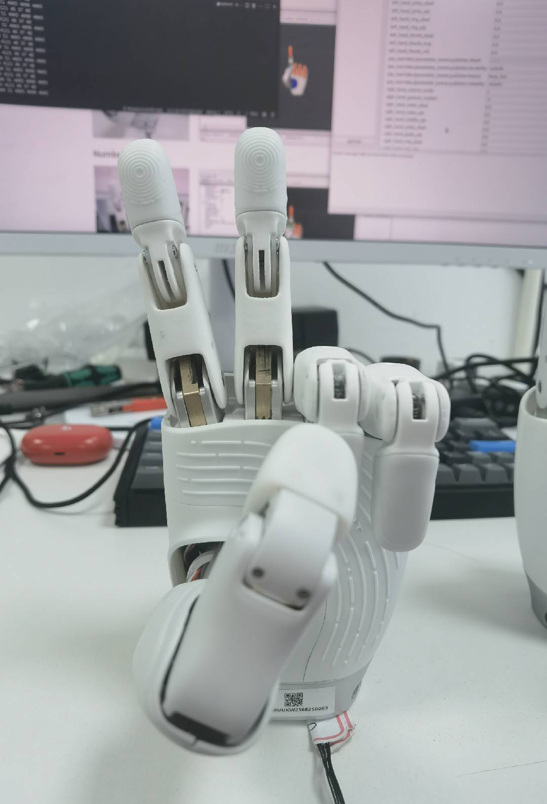
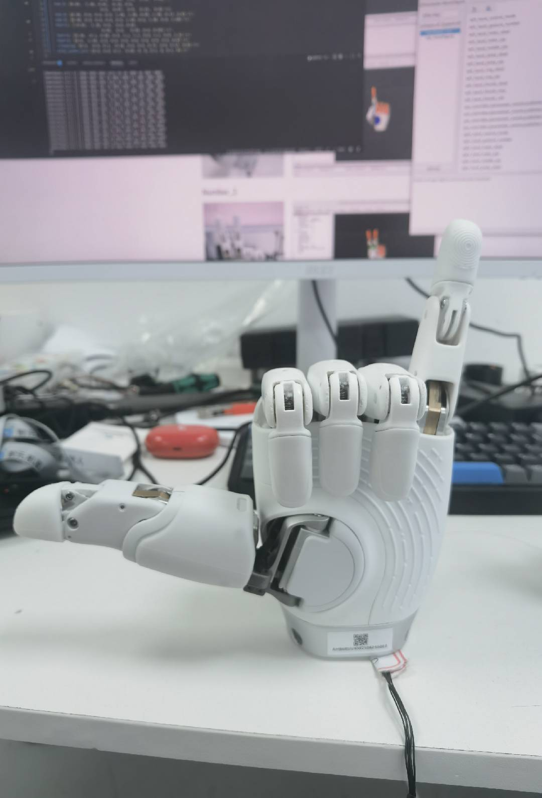
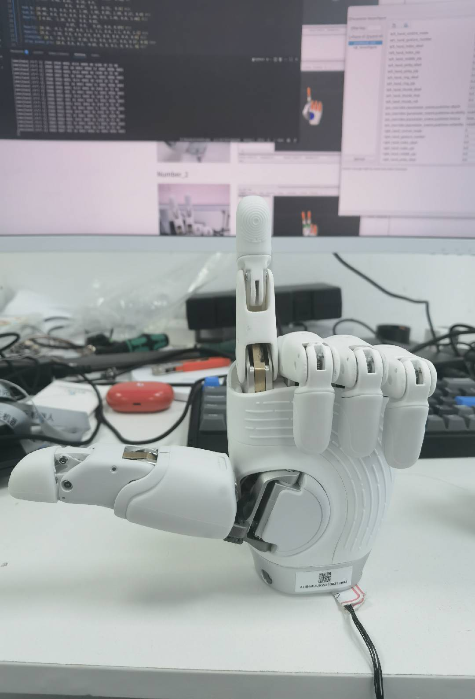
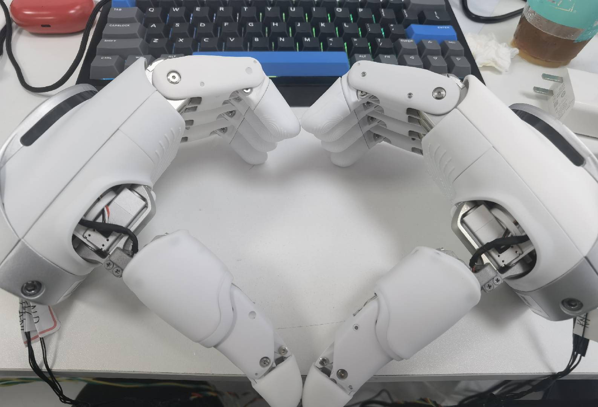
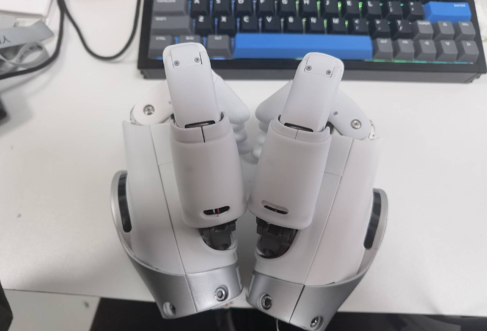
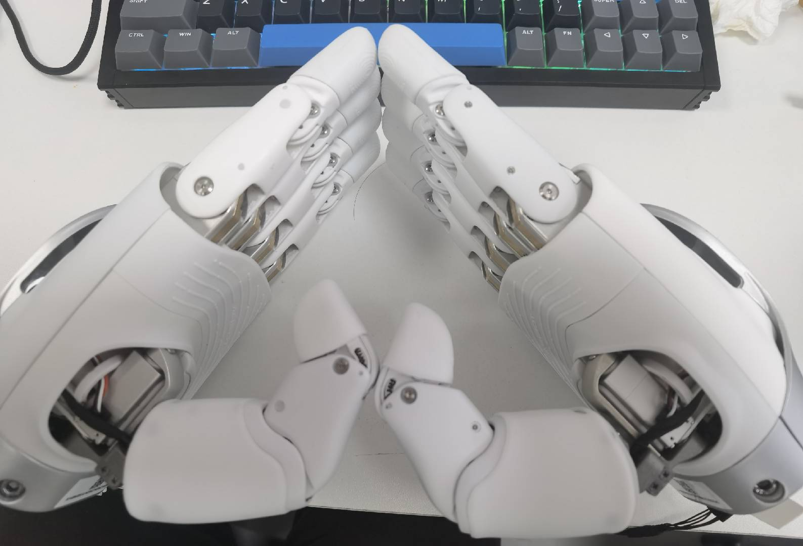

# OmniHand 2025 (O10) Kinematics Solver C++ API

## Introduction

The **OmniHand2025Solver** class (namespace: `agilink::omnihand::omnihand::o10`) provides control functionalities for the OmniHand 2025 (O10) robotic hand, including gesture setting and joint position conversion.

## Include Header

```cpp
#include "kinematics/omnihand_2025/omnihand_2025_solver.h"
```

## Constructor

```cpp
agilink::omnihand::omnihand::o10::OmniHand2025Solver(const bool& is_left_hand);
```

- **`is_left_hand`**: Set to `true` for a left-hand and `false` for a right-hand.

## Methods

### 1. SetHandGesture

```cpp
std::vector<int> SetHandGesture(OmniHand2025Gesture gesture);
```

- Sets a predefined hand gesture.
- Returns the corresponding actuator input values.
- Use `agilink::omnihand::o10::OmniHand2025Gesture` (scoped `enum class`).

| gestureID | enumerator | gesture name | gesture image |
|-----------|------------|--------------|----------------|
| 0 | `OMNIHAND_2025_GESTURE_ALL_ZERO` | all zero (all active joints zero) | |
| 1 | `OMNIHAND_2025_GESTURE_PAPER` | open hand |  |
| 2 | `OMNIHAND_2025_GESTURE_FIST1` | fist 1 |  |
| 3 | `OMNIHAND_2025_GESTURE_FIST2` | fist 2 |  |
| 4 | `OMNIHAND_2025_GESTURE_OK` | OK |  |
| 5 | `OMNIHAND_2025_GESTURE_ONE_HANDED_FINGER_HEART` | One-handed finger heart |  |
| 6 | `OMNIHAND_2025_GESTURE_LIKE` | like |  |
| 7 | `OMNIHAND_2025_GESTURE_ILY` | ILY |  |
| 8 | `OMNIHAND_2025_GESTURE_NUM1` | number 1 |  |
| 9 | `OMNIHAND_2025_GESTURE_NUM2` | number 2 |  |
| 10 | `OMNIHAND_2025_GESTURE_NUM3` | number 3 |  |
| 11 | `OMNIHAND_2025_GESTURE_NUM4` | number 4 |  |
| 12 | `OMNIHAND_2025_GESTURE_NUM6` | number 6 |  |
| 13 | `OMNIHAND_2025_GESTURE_NUM8` | number 8 |  |
| 14 | `OMNIHAND_2025_GESTURE_HAND_HEART1` | two-hand heart 1 |  |
| 15 | `OMNIHAND_2025_GESTURE_HAND_HEART2` | two-hand heart 2 |  |
| 16 | `OMNIHAND_2025_GESTURE_HAND_HEART3` | two-hand heart 3 |  |
| 17 | `OMNIHAND_2025_GESTURE_CLASPING` | clasping |  |

### 2. ActiveJointPos2ActuatorInput

```cpp
std::vector<int> ActiveJointPos2ActuatorInput(const std::vector<double>& active_joint_angles);
```

- Converts active joint positions into actuator input values.
- **Note**: O10 motor input range is 0-4096, different from O12 which is 0-2000.

### 3. ActuatorInput2ActiveJointPos

```cpp
std::vector<double> ActuatorInput2ActiveJointPos(const std::vector<int>& actuator_input);
```

- Converts actuator input values back into active joint positions.
- **Note**: O10 motor input range is 0-4096, different from O12 which is 0-2000.

### 4. GetAllJointAngles

```cpp
std::vector<double> GetAllJointAngles(const std::vector<double>& active_joint_angles);
```

- Retrieves the angles of all joints, including passive joints, based on the given active joint positions.

### 5. show_log

```cpp
void show_log(bool flag);
```

- Controls logging output. Set to `true` to enable logging, `false` to disable.

## Code Example

```cpp
#include "kinematics/omnihand_2025/omnihand_2025_solver.h"

// Create solver for right hand
agilink::omnihand::omnihand::o10::OmniHand2025Solver solver(false);

// Enable logging
solver.show_log(true);

// Set a gesture
std::vector<int> actuator_input = solver.SetHandGesture(
    o10::OmniHand2025Gesture::OMNIHAND_2025_GESTURE_FIST1);

// Convert joint positions to actuator input
std::vector<double> active_joint_angles = {0.5, -0.3, 0.6, 0.0, 1.0, 1.0, 0.0, 1.0, 0.0, 1.0};
std::vector<int> input = solver.ActiveJointPos2ActuatorInput(active_joint_angles);

// Get all joint positions (including passive joints)
std::vector<double> all_joints = solver.GetAllJointAngles(active_joint_angles);
```

## Related Documentation

- [OmniHand 2025 (O10) C++ API](API_CPP_O10.md) - Main C++ API documentation
- [OmniHand 2025 (O10) Kinematics Solver Python API](API_KINEMATICS_PYTHON_O10.md) - Python version of this API
